# Lightweight Human Digitization

|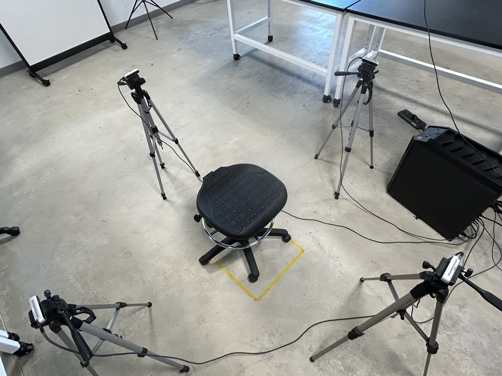|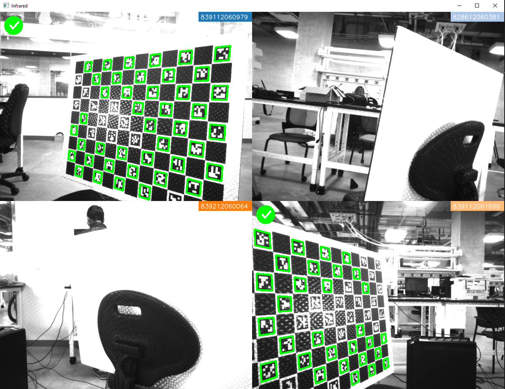|
|---|---|

Python utilities for capturing, calibrating, and reconstructing three‑dimensional human models with several Intel RealSense D415 cameras.

## Table of Contents
- [Lightweight Human Digitization](#lightweight-human-digitization)
  - [Table of Contents](#table-of-contents)
  - [Quick Start](#quick-start)
    - [Installation and Setup](#installation-and-setup)
  - [Workflow Overview](#workflow-overview)
    - [Step 1: Capturing Calibration Images](#step-1-capturing-calibration-images)
    - [Step 2: Stereo Calibration](#step-2-stereo-calibration)
    - [Step 3: Capturing New Scans](#step-3-capturing-new-scans)
  - [Directory Layout](#directory-layout)
  - [Using the Command Line Instead of the GUI for Capturing New Scans](#using-the-command-line-instead-of-the-gui-for-capturing-new-scans)
  - [Using the Command Line for Point Cloud Fusion and Mesh Generation](#using-the-command-line-for-point-cloud-fusion-and-mesh-generation)
  - [Recording and Converting `.bag` Files](#recording-and-converting-bag-files)
  - [Shell Helper: `mesh_generation.sh`](#shell-helper-mesh_generationsh)
  - [Troubleshooting](#troubleshooting)

---

## Quick Start

### Installation and Setup

Before running the scripts, ensure you have the Intel RealSense SDK installed and your cameras are connected.  The code is tested with Python 3.9+.

```bash
# clone the repo
git clone https://github.com/Girish-Krishnan/Lightweight-Human-Digitization.git
cd Lightweight-Human-Digitization

# install Python packages (use a virtual environment if possible)
pip install -r requirements.txt
```

## Workflow Overview
1. **Calibration images**—grab a series of ChArUco snapshots with `charuco_images.py`.
2. **Stereo calibration**—run `stereocalibrate.py` once.  The script writes extrinsics to `configuration_parameters.json`.
3. **Capture**—use the GUI `gui.py` or call `capture.py` from the shell.
4. **Merge point clouds and build a watertight mesh**—`combine_pcd.py` does this automatically.  The GUI calls it for you.

Repeat the calibration stages only when cameras have been moved.

### Step 1: Capturing Calibration Images

Before capturing 3D scans, you need to calibrate your cameras using [ChArUco boards](https://docs.opencv.org/3.4/df/d4a/tutorial_charuco_detection.html). This step captures images of the calibration board from multiple cameras.

<center>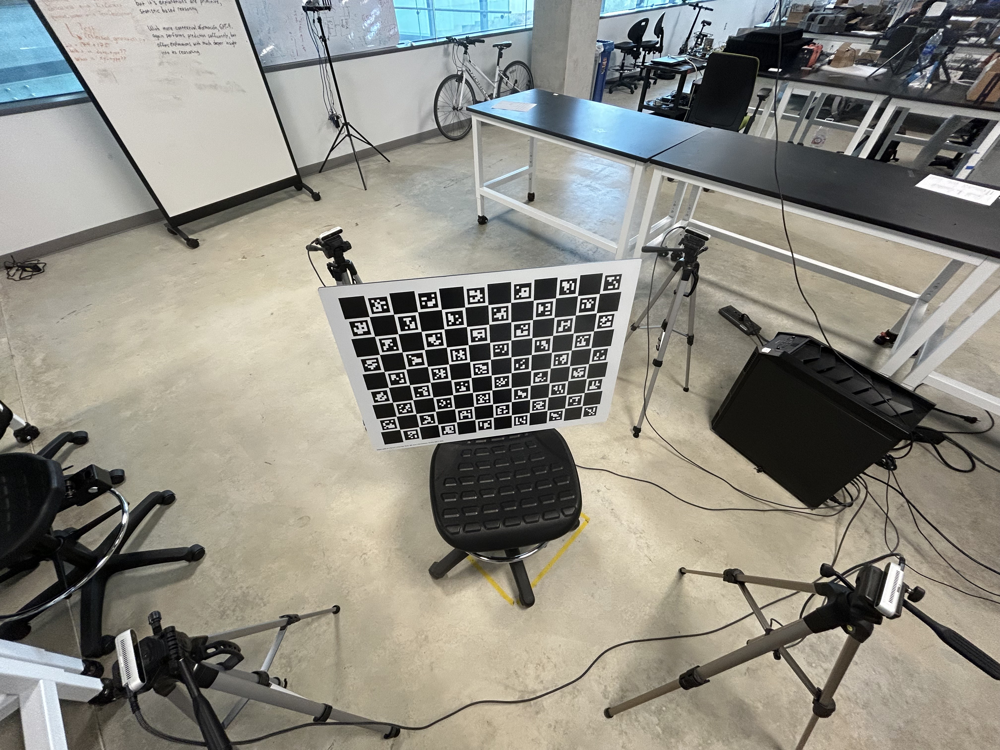</center>


Run the following command to start capturing calibration images, and replace the parameters as needed:

```bash
python charuco_images.py --output_dir ./Capture_Data --charuco_rows 8 --charuco_cols 11 --num_imgs 30
```

This detects all connected RealSense cameras and shows live infrared feeds. 

<center>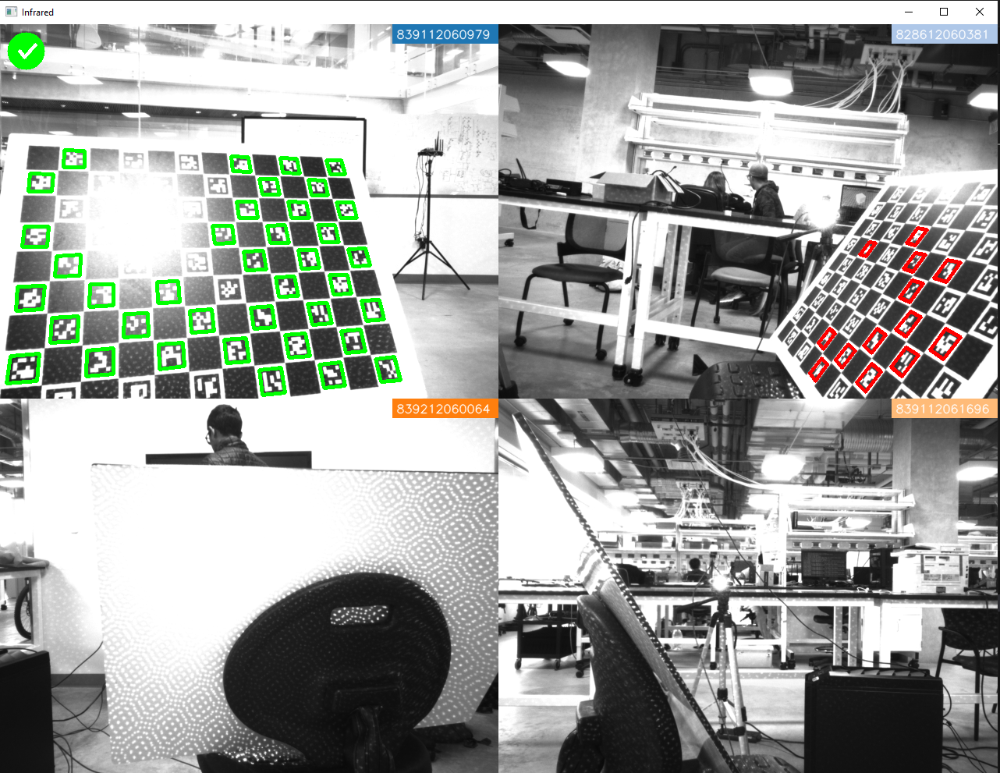</center>

In addition, it also shows a graph of the camera pairs, indicating how many images each pair of cameras has captured. The graph updates in real-time as you capture images.

| Image | Description |
|---|---|
| 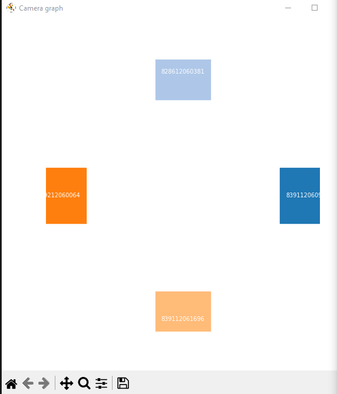 | The initial graph, with no images captured. |
| 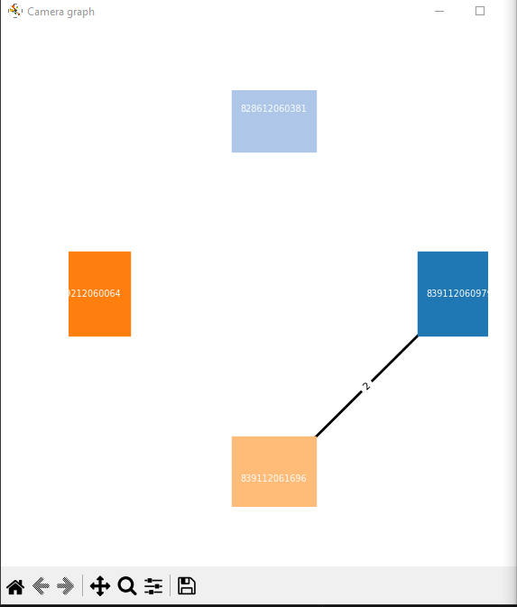 | The graph after capturing two images between two of the cameras. |
| 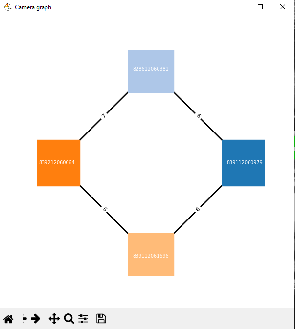 | The resulting graph after capturing some images. For example, there are 7 images captured between cameras 839212060064 and 828612060381. |

Press **space** to capture a set of images when the ChArUco board is visible in at least `--min_views` cameras (default is 2). The captured images are saved in the specified output directory.

The interface also allows you to properly adjust the ChArUco board position and orientation, ensuring it is visible in multiple cameras for accurate calibration, as explained in the table below:

|Image|Description|
|---|---|
||The ChArUco board is visible in two cameras, indicated by the green check marks.|
||The ChArUco board is visible in one camera, indicated by the green check mark. This is not sufficient for calibration. The red markings indicate the visible ChArUco markers in the other camera, which is insufficient for calibration.|
|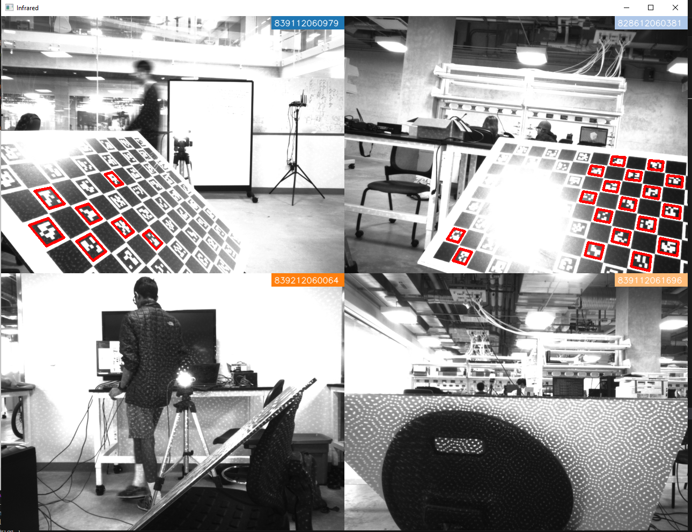|The ChArUco board is not visible in any camera, indicated by the absence of green check marks. The board must be repositioned to make the board visible in at least two cameras.|

As you press the **spacebar** to capture images, the terminal will indicate how many images you have captured.

|Image|Description|
|---|---|
|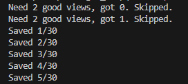|When there is insufficient coverage, the terminal output will indicate something like `Need 2 good views, got 0. Skipped`. Otherwise, it will indicate something like `Saved i/N`, where `i` is the number of successfully saved images out of `N` total images.|
|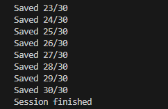|After capturing images, the terminal output will indicate the number of successfully saved images, until the process is complete.|

### Step 2: Stereo Calibration

Now that the calibration images are captured and saved, you can run the stereo calibration script to compute the extrinsic parameters between the cameras.

```bash
python stereocalibrate.py --data_dir ./Capture_Data --charuco_rows 8 --charuco_cols 11 --bundle_adjust
```

The `--bundle_adjust` flag enables nonlinear refinement of the calibration parameters using bundle adjustment. This step will read the captured images and compute the camera–camera rotation and translation blocks, which are saved in `configuration_parameters.json`.

### Step 3: Capturing New Scans

Once the cameras are calibrated, ensure they are fixed in place. The subject can be seated near the cameras, so that most of their body is visible in the cameras' fields of view. The Intel RealSense Viewer can be used to check the cameras' fields of view.

<center></center>

You can then capture new scans using the GUI:

```bash
python gui.py
```

If you followed the steps mentioned above, you can just use the default settings and click **Submit**. The GUI will handle the capture process, saving the RGB and depth frames in the specified output directory, and also fuses the point clouds into a single mesh.

<center>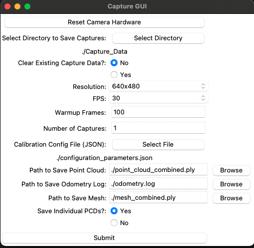</center>

The GUI has a button called "Reset Camera Hardware" that resets all connected cameras. This is useful if the cameras are not responding. Then, you can choose a directory to save the captured frames and point clouds, choose a resolution, and FPS.

The "Warmup Frames" option specifies how many frames to discard at the start of the capture to allow the cameras to stabilize their exposure and gain settings.

The "Capture Count" option specifies how many frames to capture in total. If you want to capture a video, set this to a high number. If you want to capture a single frame, set it to 1.

The "Calibration Config File" option allows you to select the `configuration_parameters.json` file generated in the previous step. This file contains the camera intrinsics and extrinsics needed for accurate depth estimation.

## Directory Layout
```
Lightweight-Human-Digitization/
├── capture.py              synchronous RGB‑D capture
├── charuco_images.py       ChArUco calibration frame capture
├── stereocalibrate.py      extrinsic solver for any number of cameras
├── combine_pcd.py          point cloud merging and mesh export
├── gui.py                  graphical front end
├── process_bag.py          convert bag recordings to RGB‑D frames
├── record_bag.py           simple RealSense recorder
├── mesh_generation.sh      helper that runs capture and fusion in sequence
├── requirements.txt
└── README.md
```
The first run of any capture script creates `Capture_Data/` with one subfolder per camera.

---

## Using the Command Line Instead of the GUI for Capturing New Scans
```bash
python capture.py \
    --output_dir ./Capture_Data \
    -w 640 -ht 480 -f 30 \
    --warmup-frames 100 \
    -n 1
```
Important flags
* `--hardware_reset` resets hardware and exits.
* `--data_reset` removes existing RGB‑D files under `--output_dir`.
* `--warmup-frames` discards early frames to allow sensor gain and exposure to stabilise.
* `-n` sets the number of captures.  The files are numbered `image_1.jpg`, `depth_map_1.npy`, and so on.

Each camera writes into `<serial>/reconstruction_images/`.

---

## Using the Command Line for Point Cloud Fusion and Mesh Generation
```bash
python combine_pcd.py \
    --config_file ./configuration_parameters.json \
    --data_dir     ./Capture_Data \
    --output_file  ./point_cloud_combined.ply \
    --mesh_file    ./mesh_combined.ply \
    --odom_file    ./odometry.log \
    --frame_number 1 \
    --save_individual   # keep per‑camera clouds
```

The script estimates normals, runs Poisson reconstruction with depth eight, smooths, removes small clusters, re‑colors vertices, then saves both cloud and mesh.  Increase the Poisson `depth` value inside the script when you need finer detail at the cost of longer processing time.

---

## Recording and Converting `.bag` Files
**Record** when real‑time capture is not possible.
```bash
python record_bag.py            # five seconds from every camera
```
**Convert** to RGB‑D frames.
```bash
python process_bag.py           # writes frames to Capture_Data
```
Edit the `bag_files` list inside `process_bag.py` for your own recordings.

---

## Shell Helper: `mesh_generation.sh`
One call that performs capture and fusion.
```bash
bash mesh_generation.sh \
    --output_dir ./Capture_Data \
    -w 640 -ht 480 -f 30 \
    --warmup-frames 100 \
    -n 1 \
    --output_file ./point_cloud_combined.ply \
    --mesh_file   ./mesh_combined.ply
```
All flags mirror those of the Python scripts.  Any flag left out falls back to the default inside each script.

---

## Troubleshooting
* **No cameras detected**—run `rs-enumerate-devices` and update firmware if needed.
* **Depth frames are all zeros**—remove the factory lens cover or increase projector power.
* **Calibration fails**—ensure each pair of cameras shares at least twenty common markers.  Lower `--threshold_charuco` when working with fewer markers.
* **Mesh has holes**—capture at higher resolution, bring cameras closer, or raise the Poisson depth value in `combine_pcd.py`.
